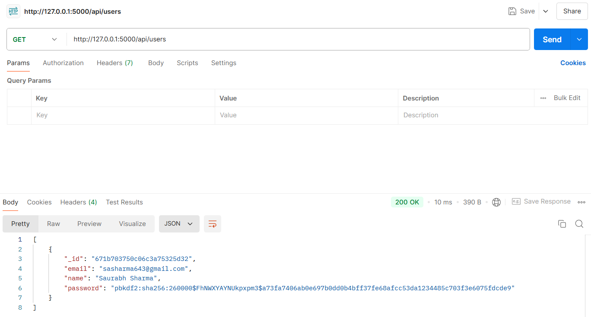
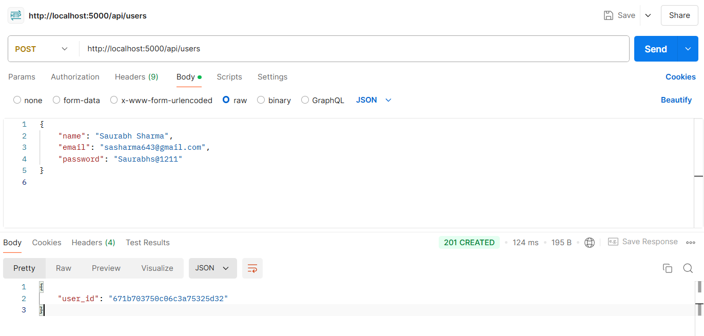
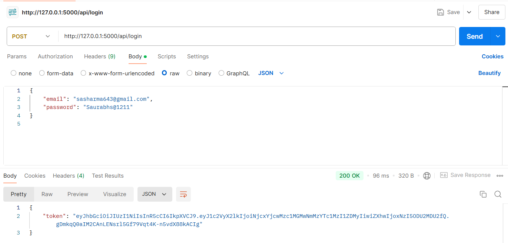
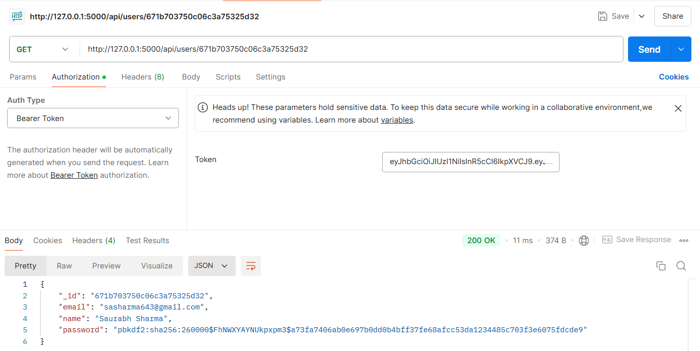
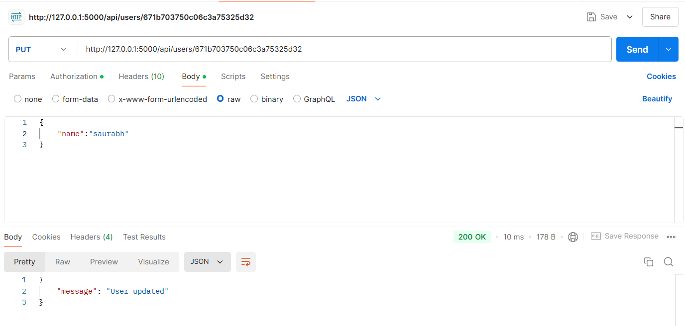
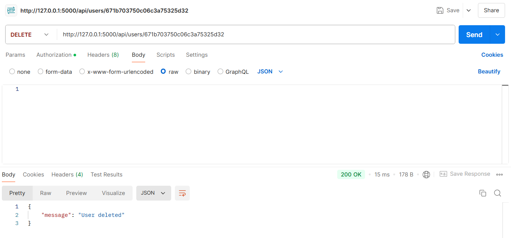

 

RESTful API for managing users, built with Flask and MongoDB. This API supports user creation, retrieval, updating, and deletion, along with JWT authentication and Redis caching for enhanced performance.

## Table of Contents

- [Features](#features)
- [Requirements](#Requirements)
- [Installation](#installation)
- [Usage](#usage)
- [API Endpoints](#api-endpoints)
- [API Testing with Postman](#api-testing-with-postman)
- [Caching](#caching)

## Features

- **User Management**: Create, read, update, and delete user records.
- **JWT Authentication**: Secure endpoints with JSON Web Tokens.
- **Redis Caching**: Improve performance for frequently accessed data.
- **RESTful Design**: Follow REST principles for easy integration.

## Requirements

- **Python 3.9**: Programming language
- **Flask**: Web framework for building the API
- **MongoDB**: NoSQL database for data storage
- **Redis**: In-memory data structure store used for caching
- **Docker**: Containerization for easy deployment ([Docker](https://www.docker.com/get-started) (including Docker Compose))

## Installation

To set up the project locally, follow these steps:

1. **Clone the repository**:

   ```bash
   git clone https://github.com/sasha643/CoRider_Assessment.git
   cd CoRider_Assessment
   ```
   
## Usage

Build and Run the Docker Container:

1. **Use Docker Compose to build the application and start the services**:

   ```bash
   docker-compose up --build
   ```
   
## API Endpoints

The API will be running on http://localhost:5000. You can use tools like Postman or curl to test the endpoints.

**Users**

- GET /api/users:
  Retrieve all users
  
- GET /api/users/<user_id>:
  Retrieve a user by ID
  
- POST /api/users:
  Create a new user
  
- PUT /api/users/<user_id>:
  Update an existing user
  
- DELETE /api/users/<user_id>:
  Delete a user by ID

**Authentication**

- POST /api/login: Obtain a JWT token for access to protected routes.

## API Testing with Postman

**GET** `http://127.0.0.1:5000/api/users`

- **Response**:
  

**POST** `http://127.0.0.1:5000/api/users`

- **Request Payload**:
    ```json
    {
      "name": "Saurabh Sharma",
      "password": "Saurabhs@1211",
      "email": "sasharma643@gmail.com"
    }
    ```
- **Response**:
  
    
**POST** `http://127.0.0.1:5000/api/login`

- **Request Payload**:
    ```json
    {
      "password": "Saurabhs@1211",
      "email": "sasharma643@gmail.com"
    }
    ```
- **Response**:
  

**GET** `http://127.0.0.1:5000/api/users/<user_id>`

- **Authorization**: Bearer token is required for this request.
  
  - **Example Request**: 
    ```http
    GET http://127.0.0.1:5000/api/users/671b703750c06c3a75325d32
    ```
    
  - **Headers**:
    ```http
    Authorization: Bearer <your_access_token>
    ```

- **Response**:
  

**PUT** `http://127.0.0.1:5000/api/users/<user_id>`

- **Authorization**: Bearer token is required for this request.
  
  - **Example Request**: 
    ```http
    PUT http://127.0.0.1:5000/api/users/671b703750c06c3a75325d32
    ```
    
  - **Headers**:
    ```http
    Authorization: Bearer <your_access_token>
    ```
- **Response**:
  

**DELTE** `http://127.0.0.1:5000/api/users/<user_id>`

- **Authorization**: Bearer token is required for this request.
  
  - **Example Request**: 
    ```http
    DELETE http://127.0.0.1:5000/api/users/671b703750c06c3a75325d32
    ```
    
  - **Headers**:
    ```http
    Authorization: Bearer <your_access_token>
    ```
- **Response**:
  
